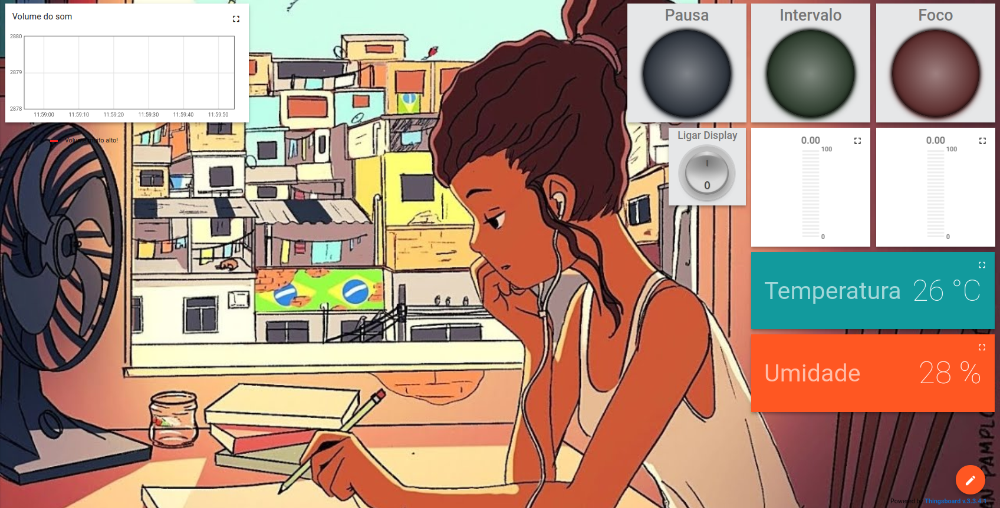

# Trabalho 3 FSE 

Trabalho Final realizado para a disciplina de Fundamentos de Sistemas Embarcados, professor Renato Coral. Ministrada em 2024/1.

**Projeto:** A definir

**Desenvolvedores:**

| Nome | Matrícula |
| --- | --- |
| Felipe Direito Corrieri de Macedo | 190086971 |
| Guilherme Keyti Cabral Kishimoto  | 190088257 |
| Iago de Paula Cabral              | 190088745 |
| Pedro Henrique Nogueira Gonçalves | 190094486 |

Aqui está o README que descreve o seu projeto:

---

# Projeto Pomodoro com Monitoramento de Ambiente

Este projeto implementa o método Pomodoro, um sistema de gerenciamento de tempo que alterna períodos de foco e descanso. Além de atuar como um timer, o sistema também realiza monitoramento ambiental coletando informações de temperatura, umidade e nível de ruído no local. Quando ocorre a mudança entre o tempo de intervalo e o tempo de foco, ou vice-versa, uma campainha é acionada para notificar o usuário.

## 1. Funcionalidades

### 1.1 Método Pomodoro

O sistema realiza o gerenciamento do tempo com base no método Pomodoro, dividido em:

- **Tempo de Foco**: Período de trabalho intenso.
- **Tempo de Intervalo**: Período de descanso.

### 1.2 Monitoramento de Temperatura e Umidade

- Para monitorar a temperatura e umidade, foi utilizado um sensor DHT11 que recebe os valores e através do protocolo MQTT passa as informações para a Dashboard. Esse sensor tem a finalidade de monitorar a qualidade do ambiente de estudo

### 1.3 Monitoramento de Ruído

- O sensor KY-038 foi usado tanto na entrada digital quanto a analógica para medir os ruídos da sala de estudo. Há um gráfico para mostrar a variação e volume do ruído e um alerta caso ultrapasse o volume adequado.

### 1.4 Notificações Sonoras

- Ao final de cada período de foco ou intervalo, o sistema aciona uma campainha, utilizando um buzzer, para notificar o usuário sobre a troca de modo. Isso ajuda a garantir que o usuário esteja ciente da mudança de atividades sem precisar monitorar ativamente o timer.

### 1.5 Representação por RGB do período

- Um RGB representa o período do Pomodoro, sendo vermelho para tempo de foco, verde para tempo de intervalo e azul para pause.

### 1.6 Ligar/Desligar o Pomodoro

- O botão de boot de uma das ESP-32 funciona como botão para ligar/desligar o Pomodoro.

### 1.7 Display

- Um oled exibe o tempo restante e o período atual.

### 1.8 Botão externo

- Um botão para pausar e despausar.

## 2. Componentes Utilizados

- **ESP32**: Microcontrolador principal, responsável por realizar o timer do método Pomodoro e gerenciar os sensores.
- **Buzzer**: Dispositivo sonoro que notifica o usuário quando ocorre a mudança entre os períodos de foco e intervalo.
- **SSD1306 LED**: Módulo display responsável pelo timer.
- **Botão**: Botão externo.
- **RGB**: LED RGB.

## 3. Comunicação MQTT

A comunicação entre o ESP32 e o servidor Thingsboard é feita via protocolo MQTT.
A comunicação entres as ESP32 é feita via protocolo MQTT com um broker público (mqtt://test.mosquitto.org).

Os dados são enviados em formato JSON, e o ESP32 é capaz de receber comandos RPC.

## 4. Modo Bateria (Deep Sleep)

O modo de bateria foi implementado na esp32-dht-ky038 e documentado no README da placa. [Clique aqui](https://github.com/FGA-FSE/trabalho-final-kishmotor-team/tree/main/esp32-dht-ky038)  para ver a documentação completa e seu funcionamento.

## Dashboard do Projeto

Link para o Dashboard [aqui](http://164.41.98.25:443/dashboards/3f139a40-631f-11ef-a0ba-5ffd78de135f)

### Imagem das Boards

As imagens de cada configuração das Protoboards estão em suas respectivas pastas.
