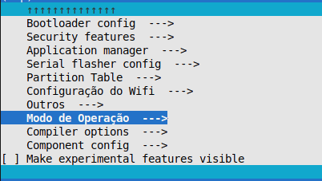
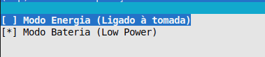
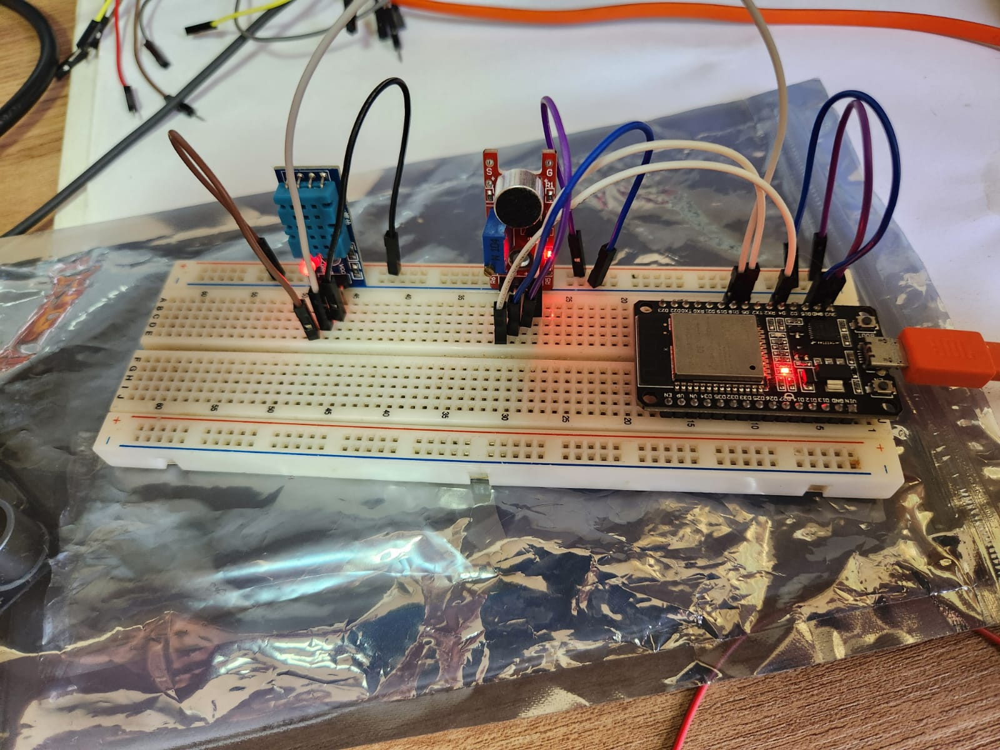

# Temperatura/Umidade e Sensor de Ruído

- Sensores: 
    - DHT11
    - KY-038

## Aplicação

Responsável pela medição da umidade, temperatura e ruído do ambiente. O sensor de ruído é Analógico e Digital.

## Modo Bateria (Deep Sleep)

Foi implementado um modo de Bateria (Deep Sleep) com o seguinte funcionamento:

1. A placa é iniciada.
2. Conecta ao WiFi.
3. Conecta ao protocolo de comunicação MQTT.
4. Envia os dados do sensor de ruído.
5. Volta a dormir por 15 segundos e volta ao passo 1.

Para ativar esse modo basta seguir os seguintes passos:

1. Entrar nas configurações da placa("menuconfig") e em "Modo de Operação"

2. Marcar  modo de Bateria

## Configuração da Board

